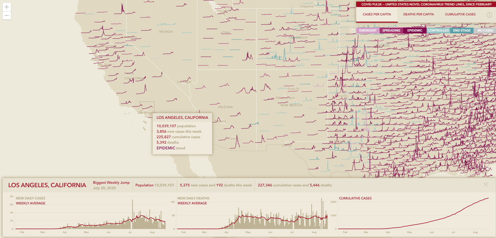

# COVID-19 Trends Map
[view it live](https://livingatlas.arcgis.com/covidpulse/)

### CASES PER CAPITA
These trend lines mark the proportion of new cases, normalized by population—useful for showing the local fluctuations of case rates throughout the outbreak. When viewing these local rates across the map, comparative national and regional patterns of transmission emerge.

### DEATHS PER CAPITA
These trend lines mark the proportion of new covid-19 related deaths, normalized by population. When viewing these local rates across the map, comparative national and regional patterns of transmission emerge. Given the incubation and illness period of the virus, these lines may show a similar pattern to CASES PER CAPITA, though with a time lag.

### CUMULATIVE CASES
These trend lines track the ongoing cumulative number of cases, normalized by population. Because it is a cumulative count, the lines will never trend downward, except in the event of data-corrective measures (see SOURCES, below).

### TREND CATEGORY COLORS
When the Trend Category option is selected, county trend lines are rendered in a color corresponding to their statistically-determined “[trend summary](https://urbanobservatory.maps.arcgis.com/apps/MapSeries/index.html?appid=ad46e587a9134fcdb43ff54c16f8c39b)”, created by Charlie Frye. Find the full methodology [here](https://www.arcgis.com/home/item.html?id=a16bb8b137ba4d8bbe645301b80e5740).

### ABOUT THE Y-AXIS
The y-axis of chart lines are consistent within each of the categories so place-to-place comparisons can be visualized—except for rare outlier counties. Outlier counties are constrained by a scaled y-axis. Specifically, outliers are defined for CASES PER CAPITA as counties with greater than 200 cases per 100,000 population; DEATHS PER CAPITA outliers are defined as counties with numbers of weekly deaths that are two standard deviations higher than the national average; CUMULATIVE CASES outliers are defined as counties with counts that are two standard deviations above the national mean.

### SOURCES
These counts are sourced from the Johns Hopkins University CSSE feature service of daily [US County Cases](https://services9.arcgis.com/6Hv9AANartyT7fJW/ArcGIS/rest/services) since February 22, 2020, and normalized into population-normalized rates using the population attribute also provided in the JHU service. Care has been taken to note, via county tooltip, when state reporting structures have impeded the Johns Hopkins University effort to aggregate this data in an ongoing fashion. Please refer to their frequently asked questions for more context around this data. The Khaki basemap is available via Living Atlas.

### Creators
This application was created by Jinnan Zhang and [John Nelson](https://adventuresinmapping.com/), of Esri, with help from [Yann Cabon](https://github.com/ycabon), inspired by the [trend line maps of Mathieu Rajerison](https://datagistips.hypotheses.org/488) and the [local 1918 flu charts of Riley D. Champine](https://twitter.com/rileydchampine/status/1243552850728411143). We are not medical professionals but saw a need for a visual sense of local rates and trends and created this primarily as a resource for ourselves but are making it available to the public in the event that it is a helpful resource for understanding patterns. We make no claims of officiality and share it only as a reference. For more geographic resources, please visit the [Esri COVID-19 hub](https://www.esri.com/en-us/covid-19/overview).
